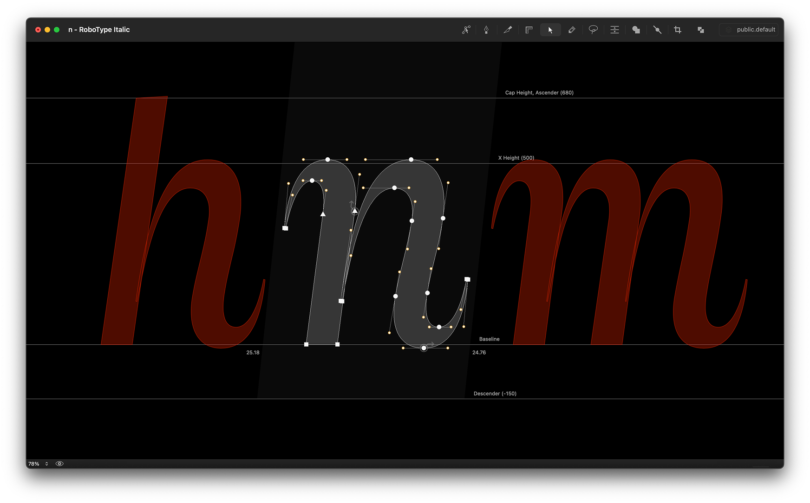
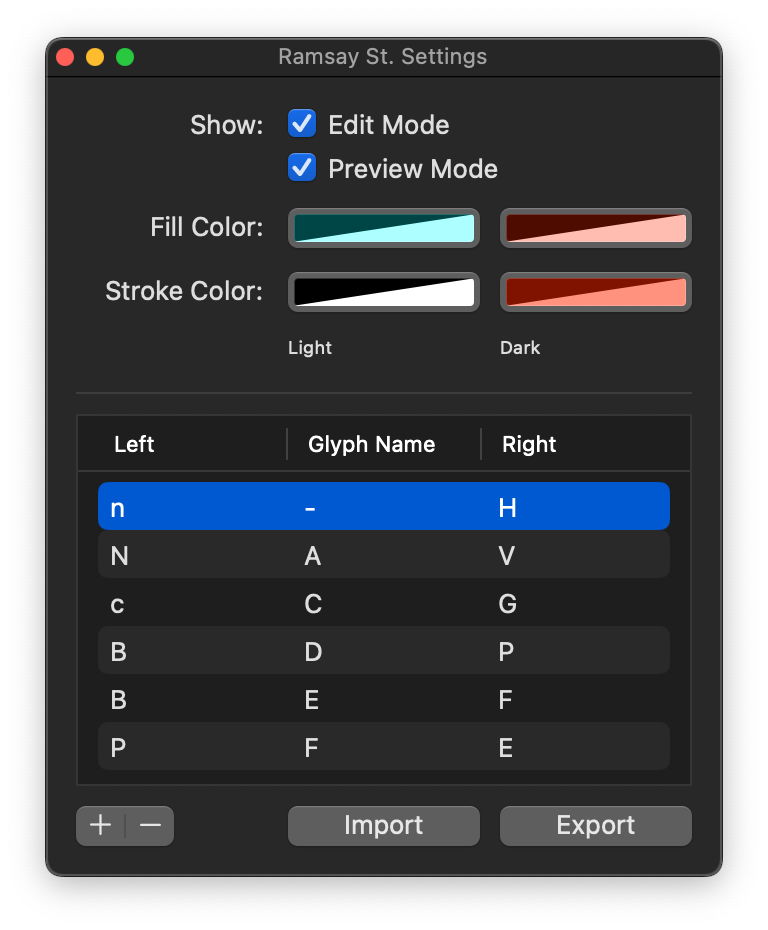

Ramsay St.
==========

A RoboFont extension to display similarly-shaped glyphs to the left & right of the current glyph.

Once installed, Ramsay St. will become available from the *Extensions* menu.

Use the menu to open the **Settings** window:

### Toggle Preview
- Use the **Edit Mode** checkbox to turn the glyph previews on/off in the Glyph Editor’s normal state.
- Use the **Preview Mode** checkbox to turn the glyph previews on/off in the Glyph Editor’s *preview* state.

### Change Colors
- Use the color swatches to pick the fill and stroke colors for the glyph previews. Light and dark modes are supported for each.

### Define Left / Right Glyphs
- Double-click the table cells to edit left/right preview glyphs for each glyph.  
- Use the +/- buttons to add/remove glyphs from the list.

### Import / Export Glyph List

- Use the **Import / Export** buttons to import or export the glyphs list to a `.ramsaySt` file for safe-keeping.

### Jump to Preview Glyph
- Triple-click a left / right preview glyph to edit that glyph in the current window.

----

    Neighbours, everybody needs good neighbours.
    With a little understanding,
    You can find the perfect blend.
    Neighbours... should be there for one another.
    That's when good neighbours become good friends.
    Ooh neighbours, should be there for one another.
    That's when good neighbours become good friends.

<embed src="http://www.youtube.com/v/64tOb0IqWZo&autoplay=1&rel=0" type="application/x-shockwave-flash" wmode="transparent"></embed>
